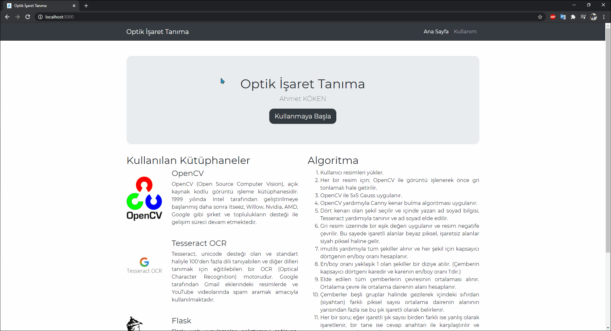

# Optik İşaret Tanıma

[English](https://github.com/ahmetkkn07/OMR)

OMR, anketler ve testler gibi belge formlarından insan tarafından işaretlenmiş verileri algılama sürecidir. Anketleri, çizgiler veya gölgeli alanlar şeklinde çoktan seçmeli sınav kağıtlarını okumak için kullanılır.

## Ön Koşullar
1. [Python](https://www.python.org/) kurulumunu gerçekleştirin.
2. [Tesseract](https://github.com/UB-Mannheim/tesseract/) kurulumunu gerçekleştirin.
3. Windows üzerinde çalışıyorsanız **pytesseract.pytesseract.tesseract_cmd** değişkenini tesseract.exe'nin bulunduğu yol ile değiştirin; Eğer macOS veya Linux üzerinde çalışıyorsanız, bu satırı yoruma alın veya silin.
4. Gerekli pypi paketlerini, aşağıdaki komutları bir terminalde sırayla çalıştırarak kurun.
  ```
  pip install requirements.txt
  ```
## Nasıl Çalışır
Ön koşulları tamamladıktan sonra repository'yi indirin veya klonlayın, klasörde terminali açın ve aşağıdaki komutu çalıştırın.
  ```
  python server.py
  ```
Tarayıcınızda [http://localhost:5000](http://localhost:5000) adresine gidin ve kullanmaya başlayın.

## Özellikler
* Görüntüden cevap anahtarı elde etme
* Doğru, yanlış ve boş soruları tespit etme
* Kağıların üzerindeki isimleri tanıma

## Önizleme


